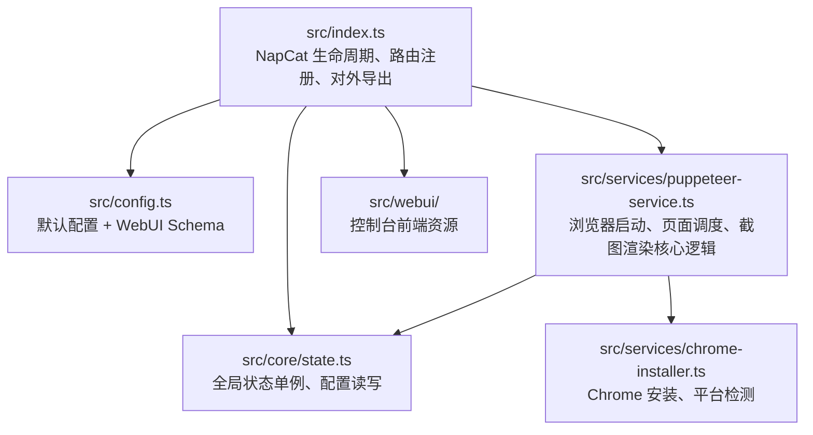

# napcat-plugin-puppeteer

> [!WARNING]
> 此插件目前处于项目刚完成阶段，可能存在较多预期外的问题。如果您遇到 bug，欢迎在 [Issues](https://github.com/AQiaoYo/napcat-plugin-puppeteer/issues) 中进行反馈。
> **请注意：** 提交反馈时请保持基本的尊重与礼貌，开发者并不欠你任何东西，无礼的言论将被直接忽视。

## 目录

- [napcat-plugin-puppeteer](#napcat-plugin-puppeteer)
  - [目录](#目录)
  - [项目简介](#项目简介)
  - [鸣谢](#鸣谢)
  - [功能亮点](#功能亮点)
  - [架构与核心模块](#架构与核心模块)
  - [运行前准备](#运行前准备)
  - [安装与部署](#安装与部署)
    - [通过 WebUI 插件市场安装（推荐）](#通过-webui-插件市场安装推荐)
    - [手动安装（发布版）](#手动安装发布版)
    - [从源码构建](#从源码构建)
  - [自动安装 Chrome（WebUI 一键安装）](#自动安装-chromewebui-一键安装)
    - [支持的平台](#支持的平台)
    - [使用方法](#使用方法)
    - [下载源选择](#下载源选择)
    - [Linux 系统依赖](#linux-系统依赖)
  - [Docker 部署远程浏览器（推荐）](#docker-部署远程浏览器推荐)
    - [为什么推荐这种方式？](#为什么推荐这种方式)
    - [方式一：与 NapCat Docker 同网络部署（推荐）](#方式一与-napcat-docker-同网络部署推荐)
      - [如果已有运行中的容器](#如果已有运行中的容器)
    - [方式二：直接运行（NapCat 非 Docker 环境）](#方式二直接运行napcat-非-docker-环境)
    - [方式三：使用 Docker Compose](#方式三使用-docker-compose)
    - [方式四：使用其他浏览器镜像](#方式四使用其他浏览器镜像)
      - [zenika/alpine-chrome（更轻量，约 400MB）](#zenikaalpine-chrome更轻量约-400mb)
    - [配置插件连接远程浏览器](#配置插件连接远程浏览器)
    - [验证连接](#验证连接)
    - [常见问题](#常见问题)
      - [Q: 连接失败怎么办？](#q-连接失败怎么办)
      - [Q: 为什么填了地址还是显示「本地模式」？](#q-为什么填了地址还是显示本地模式)
      - [Q: 端口应该填 3000 还是 3310？](#q-端口应该填-3000-还是-3310)
      - [Q: 如何验证两个容器在同一网络？](#q-如何验证两个容器在同一网络)
      - [Q: 如何查看浏览器服务日志？](#q-如何查看浏览器服务日志)
      - [Q: 如何限制浏览器资源使用？](#q-如何限制浏览器资源使用)
      - [Q: browserless/chrome 有 Web 管理界面吗？](#q-browserlesschrome-有-web-管理界面吗)
  - [NapCat Docker 用户：本地安装 Chrome 并持久化（推荐）](#napcat-docker-用户本地安装-chrome-并持久化推荐)
    - [方案一：挂载 Chrome 安装目录（推荐）](#方案一挂载-chrome-安装目录推荐)
    - [方案二：使用 Docker Volume](#方案二使用-docker-volume)
    - [方案三：构建自定义镜像（一劳永逸）](#方案三构建自定义镜像一劳永逸)
    - [注意事项](#注意事项)
  - [运行时行为](#运行时行为)
  - [API 参考](#api-参考)
    - [基础信息](#基础信息)
    - [核心接口](#核心接口)
    - [`/screenshot` 请求体（POST）](#screenshot-请求体post)
    - [`/render` 请求体（POST）](#render-请求体post)
    - [管理接口（需认证）](#管理接口需认证)
  - [响应结构与状态码](#响应结构与状态码)
  - [配置项](#配置项)
  - [WebUI 控制台](#webui-控制台)
  - [插件内二次开发](#插件内二次开发)
  - [本地开发指南](#本地开发指南)
  - [故障排查](#故障排查)
  - [许可证](#许可证)

## 项目简介

`napcat-plugin-puppeteer` 是一款为 NapCat 打造的后台渲染插件。插件基于 `puppeteer-core` 提供 Chromium 截图能力，Surfacing 为两个层面：

- **HTTP API**：其它 NapCat 插件或外部系统可通过 NapCat 提供的 HTTP 服务直接调用。
- **WebUI 控制台**：在 NapCat WebUI 中提供管理界面，用于浏览器生命周期控制、在线调试与配置。

项目使用 TypeScript + Vite 构建，产物位于 `dist/index.mjs`，可直接投放到 NapCat 插件目录使用。

## 鸣谢

本插件的实现思路参考了 [karin-puppeteer](https://github.com/KarinJS/karin-puppeteer)

## 功能亮点

- � **多源输入**：支持网页 URL、本地文件 (`file://`)、原始 HTML 字符串。
- 🧩 **模板渲染**：内置 `{{key}}` 占位符替换，可快速生成动态内容。
- �️ **截图策略**：支持单元素、全页面以及按像素高度分页输出。
- ⚙️ **弹性配置**：视口大小、设备像素比、等待策略、HTTP 头部均可定制。
- � **并发控制**：内建页面信号量，按照 `maxPages` 限制同时渲染数量，避免浏览器过载。
- 🧠 **状态可观测**：实时查询浏览器状态、总渲染次数、失败统计与运行时长。
- 🌐 **一体化管理**：WebUI 集成状态面板、渲染调试、配置面板、API 文档。

## 架构与核心模块



- `src/index.ts`：实现 `plugin_init` 等 NapCat 生命周期钩子，注册 `/plugin/{id}/api`（无认证）与 `/api/Plugin/ext/{id}`（需认证）两组路由，并暴露 `screenshot`、`renderHtml` 等函数。
- `src/core/state.ts`：`pluginState` 单例负责日志、配置文件读写、运行状态统计以及 NapCat API 调用代理。
- `src/services/puppeteer-service.ts`：封装浏览器启动、并发页面管理、模板渲染、分页截图等核心能力。
- `vite.config.ts`：通过 Vite 打包 TypeScript，内联 `puppeteer-core` 以便插件在目标环境独立运行。

## 运行前准备

> [!IMPORTANT]
> **系统要求**
> - Windows 10 / Windows Server 2016 或更高版本
> - macOS 10.15 (Catalina) 或更高版本  
> - Linux x64（不支持 ARM 架构）
>
> **不支持的系统**：Windows 7、Windows 8/8.1、Windows Server 2012/2012 R2 等旧版系统无法运行本插件（Puppeteer 不兼容）。如需在旧系统上使用，请通过[远程浏览器](#docker-部署远程浏览器推荐)方式连接。

- 安装 [NapCat](https://napneko.github.io/napcat/) 并启用插件管理功能。
- 浏览器环境（以下方式任选其一）：
  - **自动安装（推荐）**：插件支持在 WebUI 中一键安装 Chrome for Testing，支持 Windows、macOS、Linux（x64）平台
  - **手动安装**：系统需安装可执行的 Chromium 内核浏览器（Chrome、Edge 或 Chromium），插件会自动检测常见路径
  - **远程浏览器**：使用 [Docker 部署远程浏览器](#docker-部署远程浏览器推荐)，适合 Docker 环境或不想本地安装浏览器的用户
- 建议安装 `pnpm`，方便从源码构建。

## 安装与部署

### 通过 WebUI 插件市场安装（推荐）

1. 登录 NapCat WebUI。
2. 进入「插件市场」。
3. 搜索 `napcat-plugin-puppeteer`。
4. 点击「安装」并等待完成。

### 手动安装（发布版）

1. 访问 [GitHub Releases](https://github.com/AQiaoYo/napcat-plugin-puppeteer/releases) 下载最新发布包。
2. 解压并将文件夹放入 NapCat 插件目录（通常为 `%NAPCAT%/data/plugins/napcat-plugin-puppeteer`）。
3. 重启 NapCat 或在 WebUI 中重新扫描插件。

### 从源码构建

```powershell
pnpm install
pnpm run build
```

构建流程会：

- 使用 Vite 将 `src/index.ts` 打包成 `dist/index.mjs`。
- 自动将 `src/webui` 复制到 `dist/webui`。
- 精简 `package.json` 后同步到 `dist/package.json`（移除开发依赖、脚本）。

## 自动安装 Chrome（WebUI 一键安装）

插件支持在 WebUI 中自动下载安装 Chrome for Testing，无需手动配置浏览器路径。

### 支持的平台

| 平台 | 架构 | 支持状态 |
|------|------|----------|
| Windows | x64 / x86 | ✅ 完全支持 |
| macOS | Intel / Apple Silicon | ✅ 完全支持 |
| Linux | x64 | ✅ 完全支持 |
| Linux | ARM64 | ❌ 暂不支持（建议使用远程浏览器） |

### 使用方法

1. 进入 **扩展页面** → **Puppeteer 渲染服务** → **控制台**
2. 点击左侧 **设置**
3. 在 **环境管理** 区域：
   - 查看系统已安装的浏览器列表，可一键选择使用
   - 如果没有可用浏览器，点击 **立即安装 Chrome** 按钮
4. 安装过程会显示进度条，完成后自动配置并启动浏览器

### 下载源选择

| 下载源 | 说明 |
|--------|------|
| NPM 镜像（推荐） | 国内用户推荐，速度快 |
| Google 官方源 | 国外用户或需要最新版本时使用 |

### Linux 系统依赖

在 Linux 上安装 Chrome 时，插件会自动安装所需的系统依赖。支持以下发行版：

- **Debian/Ubuntu 系列**：Debian、Ubuntu、Linux Mint、Pop!_OS、Elementary OS 等
- **Fedora/RHEL 系列**：Fedora、RHEL、CentOS、Rocky Linux、AlmaLinux 等
- **Arch Linux 系列**：Arch、Manjaro、EndeavourOS 等
- **openSUSE 系列**：openSUSE、SLES 等
- **Alpine Linux**：轻量级容器环境

> ⚠️ **注意**：自动安装依赖需要 root 权限。如果没有权限，请手动安装依赖或使用远程浏览器。

## Docker 部署远程浏览器（推荐）

如果你的 NapCat 运行在 Docker 容器中，或者不想在本机安装浏览器，可以使用 Docker 部署一个独立的浏览器服务，然后通过 WebSocket 连接。

### 为什么推荐这种方式？

- ✅ **无需在 NapCat 容器中安装浏览器**：避免镜像臃肿、依赖冲突
- ✅ **资源隔离**：浏览器崩溃不会影响 NapCat 主进程
- ✅ **易于维护**：可独立重启、升级浏览器服务
- ✅ **支持多实例共享**：多个 NapCat 实例可共用一个浏览器服务

### 方式一：与 NapCat Docker 同网络部署（推荐）

> 🎯 **此方式专为 NapCat Docker 用户设计**，是最推荐的部署方案。

如果你的 NapCat 是通过 Docker 运行的，**强烈建议**将浏览器容器加入同一网络：

```bash
# 1. 创建共享网络（如果还没有）
docker network create napcat-net

# 2. 启动浏览器容器并加入网络
docker run -d \
  --name chrome-browser \
  --network napcat-net \
  --restart unless-stopped \
  -e MAX_CONCURRENT_SESSIONS=10 \
  --shm-size=2g \
  browserless/chrome:latest

# 3. 将 NapCat 容器也加入同一网络
docker network connect napcat-net <你的napcat容器名>
```

然后在插件 WebUI 设置中填写**远程浏览器地址**：

```text
ws://chrome-browser:3000
```

> ⚠️ **重要：关于端口号的说明**
> 
> 这里使用的是 **容器内部端口 `3000`**，而不是宿主机映射端口！
> 
> | 场景 | 使用的地址 | 端口说明 |
> |------|-----------|----------|
> | 从**宿主机**访问 | `ws://127.0.0.1:3310` | 使用映射到宿主机的端口 |
> | 从**另一个 Docker 容器**访问（同网络） | `ws://chrome-browser:3000` | 使用容器内部端口 |
> 
> **原理**：Docker 端口映射 `-p 3310:3000` 的含义是「宿主机的 3310 端口 → 容器的 3000 端口」。
> 当两个容器在同一 Docker 网络中时，它们直接通过容器内部网络通信，不经过宿主机，所以要使用容器内部端口。

#### 如果已有运行中的容器

如果你的 NapCat 和浏览器容器已经在运行，可以直接将它们加入同一网络：

```bash
# 创建网络
docker network create napcat-net

# 将两个容器都连接到这个网络
docker network connect napcat-net chrome-browser
docker network connect napcat-net napcat  # 替换为你的 NapCat 容器名

# 验证网络连接
docker network inspect napcat-net
```

然后在插件配置中填写：`ws://chrome-browser:3000`

### 方式二：直接运行（NapCat 非 Docker 环境）

> 💡 **此方式适用于 NapCat 直接运行在宿主机上（非 Docker）的情况**

```bash
docker run -d \
  --name chrome-browser \
  --restart unless-stopped \
  -p 3310:3000 \
  -e MAX_CONCURRENT_SESSIONS=10 \
  -e CONNECTION_TIMEOUT=60000 \
  --shm-size=2g \
  browserless/chrome:latest
```

启动后，在插件 WebUI 设置中填写**远程浏览器地址**：

```text
ws://<你的服务器IP>:3310
```

**示例**：
- 本机访问：`ws://127.0.0.1:3310`
- 局域网访问：`ws://192.168.1.100:3310`（替换为你的服务器实际 IP）

> ⚠️ **注意**：
> - `127.0.0.1` 仅在 NapCat 与浏览器运行在**同一台机器**上时有效
> - 如果 NapCat 运行在其他机器上，需要填写浏览器所在服务器的实际 IP 地址
> - 端口 `3310` 可以根据你的环境自行调整，避免与其他服务冲突

### 方式三：使用 Docker Compose

创建 `docker-compose.yml` 文件：

```yaml
version: '3.8'

services:
  chrome:
    image: browserless/chrome:latest
    container_name: chrome-browser
    restart: unless-stopped
    ports:
      - "3310:3000"    # 可自行修改端口，格式为 宿主机端口:容器端口
    environment:
      - MAX_CONCURRENT_SESSIONS=10      # 最大并发会话数
      - CONNECTION_TIMEOUT=60000        # 连接超时时间（毫秒）
      - PREBOOT_CHROME=true             # 预启动浏览器，加快首次连接
      - KEEP_ALIVE=true                 # 保持连接活跃
    shm_size: '2gb'    # 共享内存大小，建议至少 1GB
    # 可选：限制资源使用
    # deploy:
    #   resources:
    #     limits:
    #       memory: 2G
    #       cpus: '2'
```

启动服务：

```bash
docker-compose up -d
```

### 方式四：使用其他浏览器镜像

除了 `browserless/chrome`，你也可以使用其他镜像：

#### zenika/alpine-chrome（更轻量，约 400MB）

```bash
docker run -d \
  --name chrome-browser \
  --restart unless-stopped \
  -p 3310:9222 \
  --shm-size=2g \
  zenika/alpine-chrome:latest \
  --no-sandbox \
  --disable-gpu \
  --disable-dev-shm-usage \
  --remote-debugging-address=0.0.0.0 \
  --remote-debugging-port=9222
```

配置地址（需要先获取 WebSocket 地址）：

```bash
# 获取 WebSocket 地址
curl http://127.0.0.1:3310/json/version
# 返回的 webSocketDebuggerUrl 即为连接地址
```

### 配置插件连接远程浏览器

部署好浏览器服务后，在 NapCat WebUI 中配置插件：

1. 进入 **插件管理** → **Puppeteer 渲染服务** → **控制台**
2. 点击左侧 **设置**
3. 在 **远程浏览器地址 (Docker)** 中填入 WebSocket 地址，例如：
   - NapCat Docker 用户：`ws://chrome-browser:3000`
   - NapCat 非 Docker 用户：`ws://127.0.0.1:3310`
4. 保存配置后，点击 **重启浏览器** 使配置生效

### 验证连接

配置完成后，可以通过以下方式验证：

1. 在 WebUI 控制台的 **概览** 页面查看浏览器状态
2. 连接模式应显示为 **🌐 远程连接**
3. 在 **测试** 页面进行一次截图测试

### 常见问题

#### Q: 连接失败怎么办？

1. 确认浏览器容器正在运行：`docker ps | grep chrome`
2. 检查端口是否正确映射：`docker port chrome-browser`
3. 测试 WebSocket 端口是否可达：`curl http://127.0.0.1:3310/json/version`
4. 如果 NapCat 在 Docker 中，确保两个容器在同一网络

#### Q: 为什么填了地址还是显示「本地模式」？

检查以下几点：
1. 确保地址以 `ws://` 开头
2. 保存配置后需要**重启浏览器**才能生效
3. 检查 NapCat 日志是否有配置读取错误

#### Q: 端口应该填 3000 还是 3310？

这取决于你的部署方式：

| NapCat 运行环境 | 浏览器地址 | 端口 |
|----------------|-----------|------|
| 宿主机（非 Docker） | `ws://127.0.0.1:3310` | 宿主机映射端口 |
| Docker 容器（同网络） | `ws://chrome-browser:3000` | 容器内部端口 |

**原理**：`-p 3310:3000` 表示「宿主机 3310 → 容器 3000」。同一 Docker 网络内的容器直接通信，使用内部端口；从宿主机访问则使用映射端口。

#### Q: 如何验证两个容器在同一网络？

```bash
# 查看网络中的容器
docker network inspect napcat-net

# 或者进入 NapCat 容器测试连通性
docker exec -it napcat ping chrome-browser
docker exec -it napcat curl http://chrome-browser:3000/json/version
```

#### Q: 如何查看浏览器服务日志？

```bash
docker logs -f chrome-browser
```

#### Q: 如何限制浏览器资源使用？

```bash
docker run -d \
  --name chrome-browser \
  --memory=2g \
  --cpus=2 \
  # ... 其他参数
```

#### Q: browserless/chrome 有 Web 管理界面吗？

有的！访问 `http://127.0.0.1:3310` 可以看到调试界面，包括：
- 当前活跃会话
- 性能指标
- 调试工具

## NapCat Docker 用户：本地安装 Chrome 并持久化（推荐）

> 💡 **推荐**：对于单实例 NapCat Docker 用户，本地安装 Chrome 并通过 Volume 持久化是**最稳定、最省心**的方案。相比远程 Chrome 容器，不存在 WebSocket 连接断开、容器重启等问题。

通过挂载 Chrome 安装目录到宿主机，即使 NapCat 容器更新（如使用 Watchtower 自动更新），Chrome 也不会丢失。

### 方案一：挂载 Chrome 安装目录（推荐）

Chrome 默认安装在容器内 `/app/.cache/puppeteer` 目录，将此目录挂载到宿主机即可持久化：

```bash
# 创建宿主机目录
mkdir -p /path/to/napcat-data/chrome-cache

# 启动容器时挂载
docker run -d \
  --name napcat \
  -v /path/to/napcat-data:/app/napcat/data \
  -v /path/to/napcat-data/chrome-cache:/app/.cache/puppeteer \
  # ... 其他参数
  mlikiowa/napcat-docker:latest
```

**Docker Compose 配置**：

```yaml
services:
  napcat:
    image: mlikiowa/napcat-docker:latest
    volumes:
      - ./napcat-data:/app/napcat/data
      - ./napcat-data/chrome-cache:/app/.cache/puppeteer  # Chrome 持久化
    # ... 其他配置
```

这样即使更新 NapCat 镜像或使用 Watchtower 自动更新，Chrome 也会保留在宿主机上。

### 方案二：使用 Docker Volume

```bash
# 创建命名卷
docker volume create napcat-chrome-cache

# 启动容器时使用
docker run -d \
  --name napcat \
  -v napcat-data:/app/napcat/data \
  -v napcat-chrome-cache:/app/.cache/puppeteer \
  # ... 其他参数
  mlikiowa/napcat-docker:latest
```

### 方案三：构建自定义镜像（一劳永逸）

如果你希望镜像自带 Chrome，可以基于 NapCat 镜像构建：

```dockerfile
FROM mlikiowa/napcat-docker:latest

# 安装 Chrome 依赖
RUN apt-get update && apt-get install -y --no-install-recommends \
    ca-certificates \
    fonts-liberation \
    libasound2 \
    libatk-bridge2.0-0 \
    libatk1.0-0 \
    libatspi2.0-0 \
    libcairo2 \
    libcups2 \
    libdbus-1-3 \
    libdrm2 \
    libexpat1 \
    libgbm1 \
    libglib2.0-0 \
    libgtk-3-0 \
    libnspr4 \
    libnss3 \
    libpango-1.0-0 \
    libx11-6 \
    libxcb1 \
    libxcomposite1 \
    libxdamage1 \
    libxext6 \
    libxfixes3 \
    libxkbcommon0 \
    libxrandr2 \
    wget \
    xdg-utils \
    fonts-noto-cjk \
    fonts-wqy-zenhei \
    && rm -rf /var/lib/apt/lists/*

# 下载 Chrome for Testing（可选，也可以让插件自动安装）
# RUN mkdir -p /root/.cache/puppeteer && \
#     wget -q -O /tmp/chrome.zip "https://cdn.npmmirror.com/binaries/chrome-for-testing/131.0.6778.204/linux64/chrome-linux64.zip" && \
#     unzip /tmp/chrome.zip -d /root/.cache/puppeteer/chrome && \
#     rm /tmp/chrome.zip
```

构建并使用：

```bash
docker build -t napcat-with-chrome .
docker run -d --name napcat napcat-with-chrome
```

### 注意事项

1. **首次安装**：挂载目录后，首次仍需在 WebUI 中点击「安装 Chrome」
2. **权限问题**：确保挂载目录的权限正确，容器内用户可读写
3. **磁盘空间**：Chrome for Testing 约需 400MB 磁盘空间
4. **与远程浏览器方案的对比**：

| 对比项 | 本地安装 + Volume 持久化 | 远程 Chrome 容器 |
|--------|------------------------|------------------|
| 稳定性 | ⭐⭐⭐ 无连接断开问题 | ⭐⭐ 可能因容器重启导致 WebSocket 断连 |
| 部署难度 | ⭐⭐⭐ 只需加一行 Volume 挂载 | ⭐⭐ 需要额外部署和配置容器 |
| 资源隔离 | ⭐⭐ 与 NapCat 共享资源 | ⭐⭐⭐ 独立容器，资源隔离 |
| 多实例共享 | ❌ 不支持 | ✅ 多个 NapCat 可共享同一浏览器 |
| Watchtower 兼容 | ✅ Volume 挂载不受影响 | ⚠️ 两个容器可能不同步更新 |

> 💡 **建议**：单实例 NapCat Docker 用户优先选择**本地安装 + Volume 持久化**方案；多个 NapCat 实例需要共享浏览器时，选择远程 Chrome 容器方案。

## 运行时行为

- **生命周期**：`plugin_init` 读取配置、尝试启动浏览器、注册路由；`plugin_cleanup` 负责关闭浏览器。
- **HTTP 路径**：
  - 无认证：`/plugin/napcat-plugin-puppeteer/api/*`，用于插件间调用。
  - 需认证：`/api/Plugin/ext/napcat-plugin-puppeteer/*`，用于 WebUI 管理操作。
- **浏览器调度**：`puppeteer-service` 以信号量方式限制并发页面数量；每次任务都会调用 `acquirePage → screenshot → releasePage` 流程。
- **默认视口**：由 `browser.defaultViewportWidth/Height/deviceScaleFactor` 控制，调用时可通过请求覆盖。
- **统计信息**：`stats.totalRenders` 与 `stats.failedRenders` 会通过 `/status`、`/browser/status` 对外暴露。

## API 参考

### 基础信息

| 分组 | 基础路径 | 是否需要认证 | 说明 |
| ---- | -------- | ------------ | ---- |
| 公共 API | `/plugin/napcat-plugin-puppeteer/api` | 否 | 插件间调用、渲染服务入口 |
| 管理 API | `/api/Plugin/ext/napcat-plugin-puppeteer` | 是 | WebUI 使用，需携带 NapCat token |

### 核心接口

| 方法 | 路径 | 说明 |
| ---- | ---- | ---- |
| `GET` | `/status` | 查询插件运行状态、浏览器统计 |
| `GET` | `/browser/status` | 查询浏览器连接信息、版本、累计渲染数 |
| `GET` | `/screenshot` | 快速 URL 截图；支持 `raw=true` 直接返回图片流 |
| `POST` | `/screenshot` | 通用截图入口，支持 URL/HTML/文件、分页、多种编码 |
| `POST` | `/render` | HTML 模板渲染并截图（`file` 或 `html` 二选一） |

### `/screenshot` 请求体（POST）

| 字段 | 类型 | 默认值 | 说明 |
| ---- | ---- | ---- | ---- |
| `file` | `string` | - | 必填，URL / HTML / file:// |
| `file_type` | `'auto' \| 'htmlString'` | `auto` | 强制解释输入类型 |
| `data` | `Record<string, any>` | - | 模板变量（仅 HTML 模式） |
| `selector` | `string` | `body` | 页内目标选择器 |
| `encoding` | `'base64' \| 'binary'` | `base64` | 返回编码 |
| `type` | `'png' \| 'jpeg' \| 'webp'` | `png` | 图片格式 |
| `quality` | `number` | - | 1-100，仅对 `jpeg/webp` 生效 |
| `fullPage` | `boolean` | `false` | 是否截取整页 |
| `omitBackground` | `boolean` | `false` | 是否移除背景（透明） |
| `multiPage` | `boolean \| number` | `false` | 分页高度；`true` 等同 2000px |
| `setViewport` | `{ width,height,deviceScaleFactor }` | - | 覆盖默认视口 |
| `pageGotoParams` | `{ waitUntil, timeout }` | `{ waitUntil:'networkidle0' }` | 页面加载策略 |
| `waitForSelector` | `string` | - | 等待元素出现后截图 |
| `waitForTimeout` | `number` | - | 额外等待毫秒数 |
| `headers` | `Record<string,string>` | - | 请求头（仅 URL 模式） |

成功时返回 `{ code:0, data, time }`。当 `encoding=base64` 且 `multiPage=true` 时 `data` 为 Base64 数组。

### `/render` 请求体（POST）

接受字段与 `/screenshot` 大体一致，额外支持：

- `html`：直接传入的 HTML 字符串；
- `file`：当需加载本地文件或外部链接时使用；
- 如果同时传入 `html` 和 `file`，优先使用 `html`。

### 管理接口（需认证）

| 方法 | 路径 | 用途 |
| ---- | ---- | ---- |
| `GET` | `/config` | 读取当前运行配置 |
| `POST` | `/config` | 合并并保存配置（自动写入磁盘） |
| `POST` | `/browser/start` | 启动浏览器实例 |
| `POST` | `/browser/stop` | 关闭浏览器实例 |
| `POST` | `/browser/restart` | 重启浏览器实例 |

## 响应结构与状态码

所有接口遵循统一结构：

```json
{
  "code": 0,
  "data": {},
  "message": "可选的错误描述",
  "time": 123
}
```

| code | 说明 |
| ---- | ---- |
| `0` | 成功 |
| `-1` | 未定义异常、Puppeteer 内部错误 |
| `400` | 请求参数缺失或不合法 |
| `500` | 浏览器渲染失败、页面超时等 |

## 配置项

插件配置保存在 NapCat 分配的 `config.json`，默认值见 `src/config.ts`。

| 键 | 说明 | 默认值 |
| --- | --- | --- |
| `enabled` | 是否启用渲染服务 | `true` |
| `debug` | 是否输出调试日志（会在 log 中打印参数、用时） | `false` |
| `browser.executablePath` | 指定浏览器路径，留空时自动检测 | `""` |
| `browser.browserWSEndpoint` | 远程浏览器 WebSocket 地址（Docker 模式） | `""` |
| `browser.headless` | 是否使用无头模式 | `true` |
| `browser.args` | 浏览器启动参数数组 | 预置一组无头环境友好参数 |
| `browser.maxPages` | 并发页面上限 | `5` |
| `browser.timeout` | 页面导航与等待默认超时（毫秒） | `30000` |
| `browser.defaultViewportWidth` | 默认视口宽度 | `1280` |
| `browser.defaultViewportHeight` | 默认视口高度 | `800` |
| `browser.deviceScaleFactor` | 默认像素密度 | `2` |

在 WebUI 中更改配置会自动调用 `plugin_on_config_change` 保存；也可通过管理 API 写入整块配置。

## WebUI 控制台

访问 NapCat WebUI → 插件管理 → 「Puppeteer 渲染服务」，即可使用内置控制台（`src/webui/dashboard.html`）：

- **概览**：展示插件运行时间、浏览器状态、渲染统计。
- **浏览器控制**：一键启动/停止/重启浏览器实例。
- **渲染调试**：可在线编辑 HTML 模板并立即查看输出图片。
- **API 文档**：快速查看请求示例、字段说明。

控制台静态资源在插件加载时挂载至 `/plugin/{pluginId}/page/puppeteer-dashboard`。

## 插件内二次开发

除了 HTTP 调用，你也可以在 NapCat 插件代码中直接引入本插件导出的函数（需要 NapCat 支持插件依赖加载）：

```typescript
import { renderHtml, screenshotUrl } from 'napcat-plugin-puppeteer';

const image = await renderHtml('<h1>{{msg}}</h1>', {
  data: { msg: 'Hello NapCat' },
  selector: 'h1',
});

if (image.status) {
  await ctx.sendGroupMsg(event.group_id, [
    { type: 'image', data: { file: `base64://${image.data}` } },
  ]);
}
```

若运行环境无法直接引用模块，仍可通过 HTTP 接口调用，示例如下：

```typescript
const res = await fetch('http://localhost:6099/plugin/napcat-plugin-puppeteer/api/render', {
  method: 'POST',
  headers: { 'Content-Type': 'application/json' },
  body: JSON.stringify({
    html: '<div style="padding:24px"><h2>{{title}}</h2></div>',
    data: { title: 'NapCat 欢迎你' },
    encoding: 'base64',
  }),
});

const result = await res.json();
if (result.code === 0) {
  // result.data 即 Base64 字符串，可直接组装 CQ 码或 OneBot segment
}
```

## 本地开发指南

- **依赖管理**：使用 `pnpm install` 安装依赖；项目为 ESM 模式（`package.json` 中 `type: "module"`）。
- **类型检查**：运行 `npx tsc --noEmit` 进行静态检查。
- **持续构建**：执行 `pnpm run watch` 进入 Vite watch 模式，便于调试。
- **调试日志**：将配置项 `debug` 设为 `true`，即可在 NapCat 日志中看到详细调用信息。
- **打包排除**：`vite.config.ts` 将 Node 内置模块声明为 external，确保打包产物精简且运行时可用。

## 故障排查

- **浏览器无法启动**：
  1. 检查本机是否安装 Chrome/Edge/Chromium；
  2. 在配置中手动填写 `browser.executablePath`；
  3. Linux 环境若仍失败，可尝试在启动参数增加 `--no-sandbox`（默认已添加）；
  4. 考虑使用 [Docker 部署远程浏览器](#docker-部署远程浏览器推荐)。
- **远程浏览器连接失败**：
  1. 确认浏览器容器正在运行：`docker ps | grep chrome`；
  2. 检查 WebSocket 地址格式是否正确（应以 `ws://` 开头）；
  3. 测试端口是否可达：`curl http://<host>:<port>/json/version`；
  4. 如果 NapCat 在 Docker 中，确保两个容器在同一网络或端口已正确映射。
- **截图为空白**：
  1. 确认 HTML 渲染后存在目标元素；
  2. 设置 `waitForSelector` 或 `waitForTimeout` 等待前端渲染完成；
  3. 如使用远程字体，确保网络可达。
- **中文乱码**：
  1. 本地模式：在宿主系统安装中文字体；
  2. Docker 模式：使用包含中文字体的镜像，或在模板中引入 Web 字体（如 Google Fonts）。
- **渲染阻塞**：若并发量大，请调高 `browser.maxPages` 或设计队列，避免大量任务同时抢占页面。

## 许可证

MIT License © AQiaoYo
```
